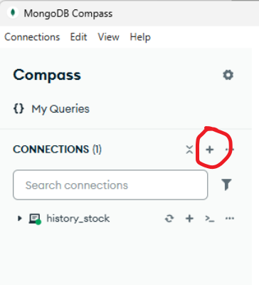
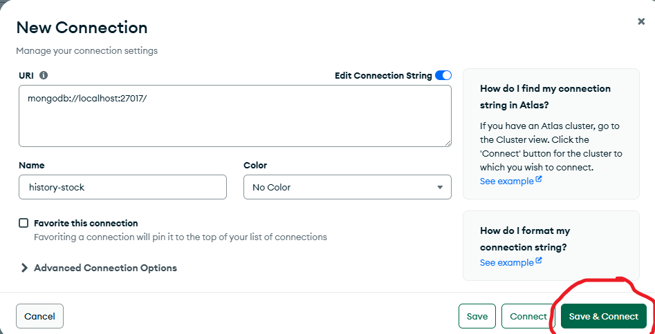
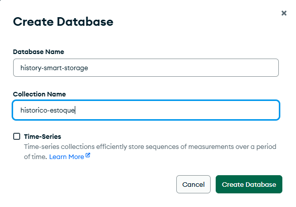

# 🍎 SmartStorage - Sistema Inteligente de Gestão de Estoques Alimentares

<div align="center">


**Solução inovadora para redução do desperdício de alimentos em instituições educacionais**

</div>

## 📋 Sobre o Projeto

O **SmartStorage** é uma plataforma web desenvolvida como Trabalho de Conclusão de Curso (TCC) para otimizar o gerenciamento de estoques alimentares em instituições educacionais. A solução combina tecnologias modernas com inteligência artificial para reduzir o desperdício de alimentos e melhorar a eficiência operacional.

## ✨ Funcionalidades

### 🏠 Gestão de Estoques
- ✅ Cadastro intuitivo de produtos alimentares
- 📅 Controle automático de datas de validade
- 🔔 Sistema de alertas para produtos próximos do vencimento
- 📱 Interface responsiva para computador e celular

### 🍳 Módulo de Receitas
- 📋 Criação e gerenciamento de receitas
- 🔍 Verificação automática de ingredientes disponíveis
- 🤖 Sugestões inteligentes de receitas baseadas no estoque

### 🔄 Compartilhamento e Colaboração
- 👥 Compartilhamento de estoques entre usuários
- 🏷️ Definição de diferentes níveis de permissão
- 📊 Histórico completo de alterações

### 🗣️ Integrações Inteligentes
- 🤖 Chatbot com IA para sugestões e dúvidas
- 🎤 Integração com Alexa para comandos de voz
- 📧 Sistema de notificações por email

## 🛠️ Tecnologias

### Frontend
- **React 18** - Biblioteca para interfaces modernas
- **Javascript** - Tipagem estática para maior confiabilidade
- **Tailwind CSS** - Framework CSS utilitário

### Backend
- **Node.js** - Ambiente de execução JavaScript
- **Express** - Framework web para APIs RESTful
- **Prisma ORM** - ORM moderno para banco de dados
- **JWT** - Autenticação segura com tokens

### Banco de Dados
- **MySQL** - Banco relacional para dados estruturados
- **MongoDB** - Banco NoSQL para histórico e logs

## 🚀 Instalação

### Pré-requisitos
- Node.js 18.0 ou superior
- MySQL 8.0+
- MongoDB Community Edition

### 📥 Configuração do Backend

```bash
# Clone o repositório
git clone https://github.com/seu-usuario/smartstorage.git
cd smartstorage/backend

# Instale as dependências
npm install

# Configure o banco de dados
npx prisma generate
npx prisma migrate dev

# Inicie o servidor de desenvolvimento
npm run dev

```

## Configuração do MongoDB:

Antes de começar lembre-se de instalar o Compass e o MongoDB para rodar o projeto

<h2>1. Abra o MongoDB Compass, depois, clique neste botão:<h2>




<h2>2. Digite no campo name:  `history-stock ` e depois clique no botão verde<h2>



<h2>3. Clique no history-stock e clique no '+' e digite no campo database name: `history-smart-storage ` e no collection name: `historico-estoque`, depois salve<h2>



<h2>Pronto, o MongoDB está pronto<h2>


